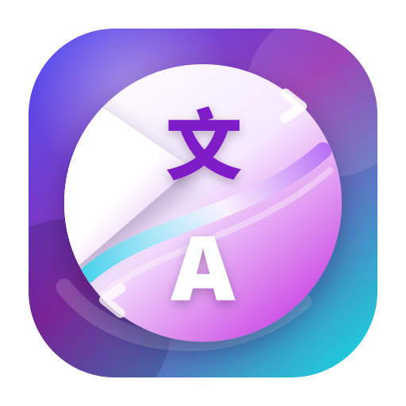

<p align="center">
  
</p>

# CopyTranslator

[简体中文](README_zh.md)

[](https://github.com/wang-borong/CopyTranslator/releases)


[](LICENSE)

CopyTranslator is a desktop translation assistant for reading, writing and
research workflows. This branch is the Tauri migration and optimization edition:
the original Electron shell has been replaced by Tauri 2, while the app keeps
the core "copy to translate" workflow and adds a refreshed interface, AI
translation, OCR, configurable shortcuts, transparent windows and modern
cross-platform release builds.

## Highlights

- Copy to translate: monitor clipboard text, clean copied PDF line breaks and
  translate immediately.
- AI translation engines: add OpenAI-compatible providers such as OpenAI,
  DeepSeek, Moonshot, Zhipu AI, Alibaba Cloud DashScope, Ollama, NVIDIA NIM,
  OpenRouter or any custom endpoint.
- Prompt customization: choose faithful, natural, technical, academic, casual or
  custom presets, and tune role prompts, system prompts, temperature, token
  limits and formatting preservation.
- Built-in translation engines: Google, Baidu, Caiyun, Youdao, Sogou, DeepL,
  Tencent, Tencent Smart, Alibaba Cloud, Azure, Volcano Engine, Yandex,
  Niutrans, StepFun and more.
- OCR translation: copy a screenshot image to the clipboard, recognize text via
  Baidu OCR REST API, then translate it.
- Productive reading modes: horizontal contrast, vertical contrast, focus mode,
  multi-source comparison, smart dictionary, smart bidirectional translation and
  incremental copy.
- Polished Tauri interface: light/dark/auto themes, adjustable fonts, content
  spacing, line height, transparency, resizable settings panel and localized
  English/Chinese UI.
- Shortcut management: configure global and in-window shortcuts from the
  Settings page.
- XDG/OS-native configuration path, with automatic migration from the old
  `~/copytranslator/copytranslator.json` location.
- GitHub Release update checks now use this repository:
  `wang-borong/CopyTranslator`.

## Basic Usage

1. Start CopyTranslator.
2. Enable clipboard listening if it is disabled.
3. Select text in a PDF, browser, editor or any other app.
4. Copy it with the system copy command.
5. CopyTranslator cleans the text, translates it and displays the result.

For split paragraphs across pages, use incremental copy. You can enable
incremental copy from the UI, right-click the layout action button for a one-shot
incremental copy, or configure a shortcut for it.

## AI Translation

CopyTranslator supports OpenAI-compatible chat completion APIs. A provider can
expose multiple models, and each enabled model becomes a selectable translation
engine.

To add an AI provider:

1. Open `Settings` -> `Custom Translators`.
2. Click `Add AI Provider`.
3. Pick a template, such as OpenAI, DeepSeek, Moonshot, Zhipu AI, DashScope,
   Ollama, NVIDIA NIM, OpenRouter or Custom.
4. Fill in the provider name, API Base URL and API Key.
5. Open advanced options if needed:
   - prompt preset
   - translator role
   - custom system prompt
   - temperature
   - max tokens
   - preserve formatting
6. Refresh the model list and select the models you want to enable.
7. Return to the main window and choose the new model from the engine menu.

The built-in StepFun entry is also available as a normal translation engine.
Availability of free or third-party models depends on the upstream service and
release configuration.

## OCR

The Tauri build currently integrates Baidu OCR through the REST API.

1. Open `Settings` -> `OCR`.
2. Enable OCR.
3. Fill in `app_id`, `api_key` and `secret_key` for `baidu-ocr`.
4. Take a screenshot and copy the image to the clipboard.
5. CopyTranslator recognizes the image text and sends it to the selected
   translation engine.

OCR requests are sent to the configured OCR service. Do not use OCR for content
that you are not allowed to upload to a third-party service.

## Shortcuts

Shortcuts can be configured in `Settings` -> `Shortcuts`.

Default global shortcuts:

| Action | Shortcut |
| --- | --- |
| Focus mode | `Shift+F1` |
| Contrast mode | `Shift+F2` |
| Simulate copy | `Super+Backquote` |
| Simulate incremental copy | `Super+Shift+Backquote` |

Default in-window shortcuts:

| Action | Shortcut |
| --- | --- |
| Copy result | `CmdOrCtrl+S` |
| Copy source | `CmdOrCtrl+D` |
| Hide window | `Escape` |
| Standard edit actions | `CmdOrCtrl+Z/X/C/V/A` |

If a global shortcut is already used by the operating system or another app,
registration can fail. Change the shortcut in Settings and save again.

## Configuration

CopyTranslator stores configuration in the OS-native config directory:

| System | Config directory |
| --- | --- |
| Linux | `~/.config/copytranslator` |
| macOS | `~/Library/Application Support/copytranslator` |
| Windows | `%APPDATA%\copytranslator` |

The main config file is `copytranslator.json`. On first run, the app attempts to
migrate the old config file from `~/copytranslator/copytranslator.json`.

API keys are stored locally in the configuration file. Treat the config directory
as sensitive data.

## Development

Requirements:

- Node.js 20 or newer
- Rust stable, with Rust 1.77.2 or newer recommended
- Platform webview dependencies required by Tauri 2

Install dependencies:

```bash
npm ci
```

Run the Tauri app in development mode:

```bash
npm run tauri dev
```

Build the frontend only:

```bash
npm run build
```

Check the Tauri backend:

```bash
cd src-tauri
cargo check --locked
```

Build release bundles:

```bash
npm run tauri build
```

Linux notes:

- The CI installs `libwebkit2gtk-4.1-dev`, `libayatana-appindicator3-dev`,
  `libxdo-dev`, `librsvg2-dev`, `patchelf`, `pkg-config`, `curl`, `wget` and
  related build tools.
- Runtime features such as simulated copy/paste and active-window detection use
  `xdotool` when available.
- Transparent windows require compositor support from the desktop environment.

## Release

The GitHub Actions workflow builds and checks Windows, macOS and Linux.

Release builds are created when:

- a tag matching `v*` is pushed, or
- the workflow is run manually from GitHub Actions.

To update the release version locally:

```bash
npm run set-release-version -- 12.1.1
```

Official downloads are attached to:

https://github.com/wang-borong/CopyTranslator/releases

The in-app update check reads the latest release from:

https://api.github.com/repos/wang-borong/CopyTranslator/releases/latest

## Privacy Notes

CopyTranslator monitors clipboard content only for local app behavior, but
translation and OCR content is sent to the engine or OCR provider you select.
Review each provider's privacy policy before sending sensitive text, documents
or screenshots.

## License

CopyTranslator is licensed under the GNU General Public License v2. See
[LICENSE](LICENSE) for details.

## Acknowledgements

This project builds on the original CopyTranslator project and the work of its
contributors. This migration edition focuses on keeping the core workflow alive
with a modern Tauri runtime, updated UI and new translation capabilities.
